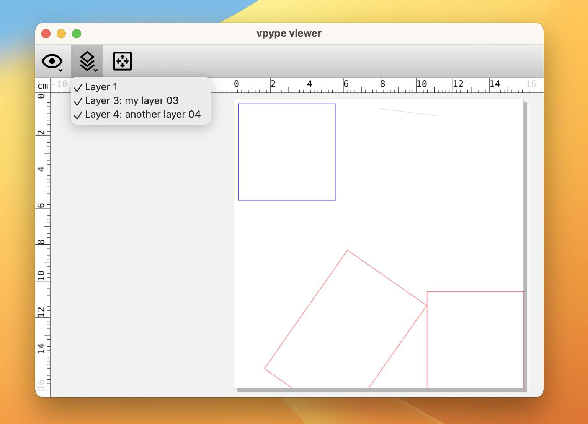

The [AxiDraw](https://axidraw.com) software, including the Inkscape plug-in, the AxiDraw CLI, and the Python module, offers a pretty neat way to control the plotting process with special escape codes in layer names. *vpype* doesn't have an explicit support for this feature [yet](https://github.com/abey79/vpype/issues/604), but it can give arbitrary names to layers using the [`name`](https://vpype.readthedocs.io/en/latest/reference.html#name) command---including ones that the AxiDraw understands.

This article explores the topic of layers, their name, and how they can be used to control the AxiDraw plotting process. 


## SVG has layers?

Actually, no.

Instead, SVG has groups, which can be nested or omitted altogether, which is not exactly the same thing. For this reason, the Inkscape project has introduced an [XML namespace](https://inkscape.org/namespaces/inkscape/) named [`inkscape`](https://inkscape.org/namespaces/inkscape/) to support its layer feature. Amongst other thing, it defines the `inkscape:groupmode="layer"` group attribute, to mark a top-level group as layer, and the `inskscape:label` attribute, to assign a label---or name---to the layer:

```svg
<?xml version="1.0" encoding="utf-8" ?>
<svg xmlns="http://www.w3.org/2000/svg"
     xmlns:inkscape="http://www.inkscape.org/namespaces/inkscape"
     height="10.0cm" width="10.0cm">
  <g inkscape:groupmode="layer" inkscape:label="my layer label" >
      <!-- first layer's content -->
  </g>
  <g inkscape:groupmode="layer" inkscape:label="my other layer" >
      <!-- second layer's content -->
  </g>
</svg>
```

The Inkscape extension has become the *de facto* standard for SVG layer definition and naming, and is used by both *vpype* and the AxiDraw software.


## *vpype* has layers? 

[Yes](https://vpype.readthedocs.io/en/latest/fundamentals.html#lines-and-layers).

Layers are first-class citizens in *vpype*, and, like any good citizen, they are primarily identified by a non-zero, positive integer identification number, in this case called "layer ID". When loading an SVG, *vpype* try to construct its layer based on their Inkscape label, if any, their SVG group `id` (`<g id="...">`) if any, or sequentially otherwise. For example, when `read`ing an Inkscape file with two layers named "layer 4" and "some layer 6", *vpype* will assign layer IDs 4 and 6 to these layers[^lid]. If the label and group ID lack numerical digits, then *vpype* will revert to using sequential IDs.

[^lid]: Note that [*vpype* 1.13]() introduced a minor change on how exactly this is done.

One of the easiest ways to visualise layers and their IDs is to use the [`show`](https://vpype.readthedocs.io/en/latest/reference.html#show) and the viewer's layer menu:



Both the layer ID and the label, if any, is shown.

Many *vpype* commands operate on a layer-by-layer basis. They are known as [layer processors](https://vpype.readthedocs.io/en/latest/fundamentals.html#layer-processors). By default, they operate on *all* layers---for example `translate 0 2cm` translates the whole document by 2 cm vertically. For more control, the exact layer(s) on which the command should operate can be specified using the `--layer LID` option (or `-l LID` for short). For example, `translate -l 3 0 2cm` will translate *only* layer 3. Likewise, `translate -l 3,4 0 2cm` will translate both layer 3 and 4.


## AxiDraw escape codes

The [EMSL](https://www.evilmadscientist.com) [wiki](https://wiki.evilmadscientist.com/Main_Page) contains a [thorough description](https://wiki.evilmadscientist.com/AxiDraw_Layer_Control#Syntax) of the supported escape codes and their effect. Here is a summary of what can be achieved:

- By prefixing the layer name with a number in the range of 0 to 1000, layers can be grouped together and enabled/disabled by the AxiDraw software (this resembles, but is not to be confused with *vpype*'s layer IDs). For example, `10 my layer` assigns the number 10 to the corresponding layer. With the "Layer" tab of the InkScape extension, it is possible to plot all layers prefixed with a given number. 
- The pen down position can be adjusted by adding `+H` immediately followed by a number right after the layer number, e.g. `10+H55 my layer` sets the pen down position to 55. This works without layer number as well, e.g. `+H55 my layer`.
- Likewise, the pen down speed can be adjusted with `+S`, e.g. `12+S30 my layer`.
- Another possibility is to set a delay at the beginning of a layer using `+D`. This enables behaviours such as letting time for the ink to dry, or for a timelapse picture to be taken.
- A layer may be marked as "do not plot" by adding `%` at the beginning of the layer name. This could be used to add debug elements or decorations to an SVG that should not be physically plotted.
- Likewise, starting the layer name with `!` will force the AxiDraw to pause, for example to allow for paper swapping.


## Naming layers

Equipped with this understanding of how layers work, let's use the [`name`](https://vpype.readthedocs.io/en/latest/reference.html#name) command to control the AxiDraw. For example, the drawing speed for layer 3 can be specified this way:

```bash
vpype  read multilayer.svg  name -l 3 "+S30 my layer label"  write output.svg 
```

*vpype* 1.13 [introduced]() a new `lid` built-in expression variable which comes in handy in this context. It can be used to match the AxiDraw layer number with *vpype*'s layer ID:

```bash
vpype  read multilayer.svg  name -l 3 "%lid%+S30 my layer label"  write output.svg 
```

In this case, layer 3 is renamed "3+S30 my layer label". The nice thing is that this also works when renaming multiple layers at once. For example:

```bash
vpype  read multilayer.svg  name -l 3,4 "%lid%+S30"  write output.svg 
```

Here, layer 3 and 4 are renamed "3+S30" and "4+S30", respectively.


## Empty layers

To achieve certain behaviours with the AxiDraw, one may need to insert any empty layer with a specific name. For example, a final empty layer named "+D1000" makes the AxiDraw pause for one second in pen-up position at the final drawing location, before moving the head back to the home position.

Interestingly, there is currently no explicit support in  *vpype* to create empty layers. The layer manipulation commands (like [`lmove`](https://vpype.readthedocs.io/en/latest/reference.html#lmove), [`lcopy`](https://vpype.readthedocs.io/en/latest/reference.html#lcopy), etc.) specifically remove layers they leave empty.

While preparing this article, I realised that one command could be used to create an empty layer: [`random`](https://vpype.readthedocs.io/en/latest/reference.html#random). Its purpose is to generate some random lines for debugging purposes, but the number of lines it generate can luckily be controlled. So here is how to create an empty layer with ID 5:

```bash
vpype  [...]  random -l 5 -n 0  [...]
```

The `-n 0` option tells `random` to generate 0 random lines, but it still creates the layer. This can be verified using the [`stat`](https://vpype.readthedocs.io/en/latest/reference.html#stat) command:

```bash
vpype  random -l 5 -n 0  stat
```

This prints the following output:

```
========= Stats =========
Current page size: None
Layer 5
  Length: 0
  Pen-up length: 0.0
  Total length: 0.0
  Mean pen-up length: 0.0
  Median pen-up length: 0.0
  Path count: 0
  Segment count: 0
  Mean segment length: n/a
  Bounds: None
  Properties:
Totals
  Layer count: 1
  Length: 0.0
  Pen-up length: 0.0
  Total length: 0.0
  Path count: 0
  Segment count: 0
  Mean segment length: n/a
  Bounds: None
  Global properties:
=========================
```

Layer 5 exists, but is empty.

<br/>

That about wraps up what can be said on *vpype* layers, their names, and how they can interact with the AxiDraw. I'd love to hear about your creative use of these features, in the comments or on the socials.


<!--

## Putting it all together

Let wrap up by considering a complete example. We'll use [this SVG](example.svg) as starting point:


This is a two-layer file laid out on 10x10cm page.

For the purpose of this example, let's say we want to control the pen-down height and speed for the two layers, and then create an ink-bleed stain in the middle.

```bash
vpype \
  read  example.svg \
  name "%lid%+H35+S50" \
  circle -l 3 5cm 5cm 0.1px \
  name -l 3 %lid% \
  random -l 4 -n 0 \
  name -l 4 "%lid%+D10000" \
  show
```

Here is what happens:
- After reading the input file, we first rename the two layers to set the pen-down height to 35 and the speed to 50.
- We then draw a tiny circle in the middle of a new layer with an ID of 3, which we renamed with its number[^name].
- Then, we create an empty layer with ID 4, which we rename "4+D10000" to tell the AxiDraw to make a 10-second pause before starting layer 4. This happens right at the end of plotting layer 3, *before* the pen is raised to move to layer 4. This effectively lets the pen bleeding just after drawing the small circle.

[^name]: This is technically not necessary as the [`write`](https://vpype.readthedocs.io/en/latest/reference.html#write) automatically uses the ID as name for unnamed layers.

And here is the final result, ready to be plotted with the AxiDraw:


-->
